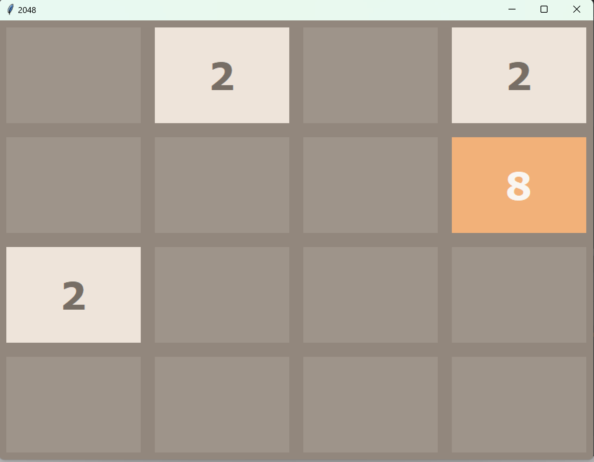

2048 Python 游戏复刻版

重要提示⚠️: 本项目是基于 [Yangshun Tay 和 Emmanuel Goh 的 2048 Python 版本](https://github.com/yangshun/2048-python)
进行学习和复刻。原始项目已不再接受贡献，因此本项目仅为学习交流目的。

项目简介：
本项目为个人学习研究使用，尽可能遵循PEP8标准，仅提供中文注释。  
如有需要请自取，如果喜欢或有帮助到你请点个star吧



如何开始游戏
在本地环境中安装所需依赖并运行 main.py 文件：

Code

```commandline
python3 main.py
```

协议与许可
本项目严格遵守原项目采用的 [MIT 许可协议](https://github.com/yangshun/2048-python/blob/master/LICENSE)
。尽管本项目对原作进行了复刻，但所有核心逻辑和设计灵感均源自 Gabriele Cirulli 及其衍生作品（包括但不限于 Yangshun Tay 和
Emmanuel Goh 的 2048 Python 版本）。

致谢
模仿及学习自：

- [Yanghun Tay](http://github.com/yangshun)
- [Emmanuel Goh](http://github.com/emman27)